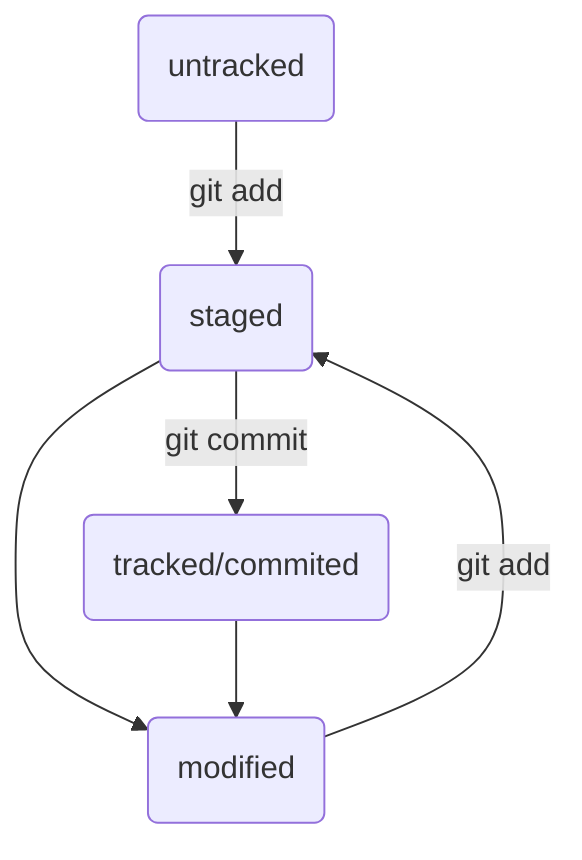

# GIT от простого к сложному
   
***GIT*** - это система управления исходным кодом ( SCM ), система 
контроля версий (VCM)
 
* Созадаем директорию в которой будем храниться проэкт _git_ c помощью команды `mkdir`.
* Переходим в эту директорию ( `cd назавание директории` ) и создаём гит репозиторий `git init`.

## Подключение к удааленному репозиторию

+ Переходим на сайт [github](https://www.hithub.com 'гитхаб').
- Авторизируемся 
+ Создаём удалённый репозиторий
+ Связываем удалённый репозиторий с локальным ропозиторием `git remote add (назавание удаоенного репозитория)origin  main(локальный)`

## Создание, созхранение и отправка изменений на удаленный репозиторий

> Создадим файл `touch имя_файла`
>
> Сохраним измененеия в локальном репозитории `git add имя_файла && git commit -m 'описание комита'`
>
> Отправим в удаленный репощзиторий первый раз `git push -u origin main` последуйщие `git push`
>
> Проверим состояние `git status`

## Hash, Log, Head

>Hash
	основной индификатор коммита. Зная хаш можно получить информацию о коммите.

>Log
	Log - просмотр информации о коммитах `git log`
	`git log --oneline` - выводит информацию о коммитаз в коротком выводе

>Head
	**Head**
  
	ссылка на последний коммит. В рабочей директории проэкта файл содержит \
ссылку на другой файл .git/HEAD. А тот файл ссыдкается на на .git/refs/heads/main(в щависемости от названия ветки).\
 файл main содержит хеш последнего коммита.  

	
